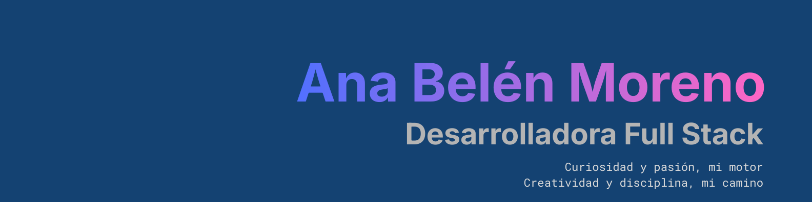

  

# 👋 ¡Hola! Soy Ana

Soy **desarrolladora web** apasionada por crear **experiencias interactivas, atractivas y funcionales**.  

He trabajado con **Angular, Symfony y PostgreSQL**, desarrollando **paneles de administración** e interfaces **escalables y fáciles de usar**.  

Me interesa especialmente la **UX, la usabilidad y la accesibilidad**, buscando siempre interfaces **claras y eficientes**.  

✨ Siempre aprendiendo, adaptándome a nuevas tecnologías y explorando cómo la **IA** puede potenciar mis proyectos.  

---

## 🛠️ Tecnologías y Herramientas  

### 💻 Lenguajes  

### 🏗️ Frameworks y Plataformas  

---

## 📊 Estadísticas  

  
  

  

---

## 📫 Contacto

---

  ✨ Gracias por visitar mi perfil. ¡Echa un vistazo a mis repositorios y proyectos!

